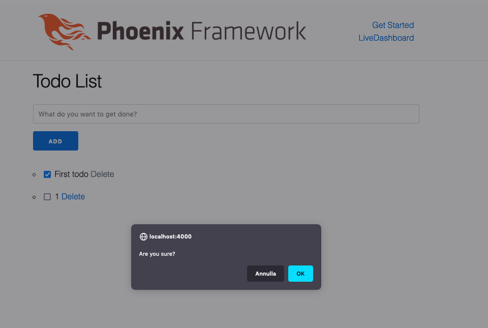

# Come realizzare una To Do List con Phoenix LiveView

In questi ultimi anni sta nascendo un particolare interesse per Elixir e il suo framework Phoenix. Questo linguaggio di programmazione sfrutta la Virual Machine di Erlang che è nota per essere nativamente: multi-concorrente, fault-tolerant e distribuito. Useremo Phoenix e la libreria LiveView per implementare una semplice To Do List.

## Prerequisiti

Per questa guida è necessario aver installato sul proprio computer:

* Mix
* Elixir
* Phoenix
* Postgres

## Creazione del progetto

Per iniziare creiamo il progetto utilizzando il comando:

```
mix phx.new todo_app --live
```

Con il parametro `--live` indichiamo di voler includere `Phoenix.LiveView` all'interno del progetto. Entriamo nella nuova cartella e seguiamo i passi indicati a fine installazione, creando il database e lanciando il server per verificare di aver eseguito correttamente i passi precedenti.

## Creazione del modello

Le informazioni ricevute dall'utente saranno salvate all'interno del database. Adesso creiamo la tabella dei Todo con una migrazione:

[Link al commit](https://github.com/cantierecreativo/todo_app/commit/507f4886213b621d7f43a4be2378ffb65fabe8ce)

```
mix phx.gen.context Todos Todo todos title:string
```

## Creazione del componente LiveView

[Link al commit](https://github.com/cantierecreativo/todo_app/commit/be95a4e50bf0bfc43e744c54d30eccde5643ac16)

In questa fase creeremo il componente che ci consentirà di visualizzare tutte le attività, crearne di nuove o di eliminarle. Creaiamo il nuovo file:

```elixir
# lib/todo_app_web/live/todo_live.ex

defmodule TodoAppWeb.TodoLive do
  use TodoAppWeb, :live_view

  def mount(_params, _session, socket) do
    {:ok, socket}
  end

  def render(assigns) do
    ~L"""
      <h1>Hello World!</h1>
    """
  end
end
```

Modifichiamo il router nel modo seguente:

```elixir
#
scope "/", TodoAppWeb do
  pipe_through :browser

  # live "/", PageLive, :index
  live "/", TodoLive
end
```

Ritornado sul browser dovreste vedere questa schermata:


## Visualizzare la lista

[Link al commit](https://github.com/cantierecreativo/todo_app/commit/dc58ed1d430c4fccb76854f8eddabbcbc0e334ec)

Iniziamo con il creare qualche elemento da poter visualizzare in seguito. Eseguiamo dal terminale:

```
$ iex -S mix
> alias TodoApp.Todos
TodoApp.Todos
> Todos.create_todo(%{title: "First todo"})
[debug] QUERY OK db=4.0ms decode=1.4ms queue=2.0ms idle=652.3ms
INSERT INTO "todos" ("title","inserted_at","updated_at") VALUES ($1,$2,$3) RETURNING "id" ["First todo", ~N[2021-07-09 10:45:00], ~N[2021-07-09 10:45:00]]
{:ok,
 %TodoApp.Todos.Todo{
   __meta__: #Ecto.Schema.Metadata<:loaded, "todos">,
   id: 1,
   inserted_at: ~N[2021-07-09 10:45:00],
   title: "First todo",
   updated_at: ~N[2021-07-09 10:45:00]
 }}
```

Modifichiamo il componente `TodoLive` nel modo seguente:

```elixir
# lib/todo_app_web/live/todo_live.ex

defmodule TodoAppWeb.TodoLive do
  use TodoAppWeb, :live_view

  alias TodoApp.Todos

  def mount(_params, _session, socket) do
    {:ok, fetch(socket)}
  end

  def render(assigns) do
    ~L"""
      <h1>Todo List</h1>
      <ul>
        <%= for todo <- @todos do %>
          <li><%= todo.title %></li>
        <% end %>
      </ul>
    """
  end

  defp fetch(socket) do
    assign(socket, %{todos: Todos.list_todos()})
  end
end
```

Esaminiamo in dettaglio le nuove modifiche:

* Con `alias` indichiamo di voler creare una scorciatoia per il modulo `TodoApp.Todos` in modo da scrivere solamente `Todos`;
* La funzione `fetch` si occupa di assegnare al socket una collezione che ha come chiave `todos` e come valore la lista di tutti gli elementi. In questo modo rendiamo disponibile all'interno della funzione render la variabile `@todos`.


## Aggiungere lo stato di completamento

[Link al commit](https://github.com/cantierecreativo/todo_app/commit/6cfae03b85d913fdd31c1b1da5a571a6d19c4d69)

In questa fase vogliamo avere la possibilità di spuntare un elemento della lista per indicare che il compito è stato portato a termine.

Per prima cosa dovremmo aggiungere alla tabella dei Todo l'attributo `completed`.

```
$ mix ecto.gen.migration AddCompletedToTodos
```

Apriamo il nuovo file inserendo il nuovo attributo:

```
defmodule TodoApp.Repo.Migrations.AddCompletedToTodos do
  use Ecto.Migration

  def change do
    alter table(:todos) do
      add :completed, :boolean, default: false
    end
  end
end
```

Eseguiamo la migrazione con il comando `mix ecto.migrate`. Successivamente dobbiamo modificare il changeset e lo schema di Todo:

```elixir
# lib/todo_app/todos/todo.ex

defmodule TodoApp.Todos.Todo do
  # ...
  schema "todos" do
    ...
    field :completed, :boolean
    ...
  end

  # ...
  def changeset(todo, attrs) do
    # ...
    |> cast(attrs, [:title, :completed])
    # ...
  end
end
```

Possiamo visualizzare all'interno del terminale il nuovo attributo:

```
$ iex -S mix
> alias TodoApp.Todos
TodoApp.Todos
> Todos.get_todo!(1)
[debug] QUERY OK source="todos" db=6.2ms idle=1626.5ms
SELECT t0."id", t0."title", t0."completed", t0."inserted_at", t0."updated_at" FROM "todos" AS t0 WHERE (t0."id" = $1) [1]
%TodoApp.Todos.Todo{
  __meta__: #Ecto.Schema.Metadata<:loaded, "todos">,
  completed: false,
  id: 1,
  inserted_at: ~N[2021-07-09 11:05:48],
  title: "First todo",
  updated_at: ~N[2021-07-09 11:05:48]
}
```

# Modificare lo stato del completamento

[Link al commit](https://github.com/cantierecreativo/todo_app/commit/f97797a6f50c4abc2eb5fa111c83d98003eb76fc)

Adesso vogliamo visualizzare nell'app una checkbox per modificare il l'attributo completed del relativo todo. Modifichiamo il componente `TodoLive` nel modo seguente:

```elixir
# lib/todo_app_web/live/todo_live.ex

defmodule TodoAppWeb.TodoLive do
  ...

  def render(assigns) do
    ~L"""
      <h1>Todo List</h1>
      <ul>
        <%= for todo <- @todos do %>
          <li>
            <%= content_tag :input,
                nil,
                type: 'checkbox',
                phx_click: 'toggle-todo',
                phx_value_todo_id: todo.id,
                checked: todo.completed %>
            <%= todo.title %>
          </li>
        <% end %>
      </ul>
    """
  end

  def handle_event("toggle-todo", %{"todo-id" => id}, socket) do
    todo = Todos.get_todo!(id)

    {:ok, _} = Todos.update_todo(todo, %{completed: !todo.completed})

    {:noreply, socket}
  end

  ...
end
```

Analizziamo l'input della checkbox. Come possiamo osservare abbiamo aggiunto due attributi al nodo: `phx_click` e `phx_value_todo_id`. Il primo indica che al click dell'elemento dovrà essere richiamato l'handle `toggle-todo`. Il secondo sarà utilizzato per passare una Map con la chiave `todo_id` alla funzione `handle_event` con il valore dell'id del todo.

La funzione `handle_event` ha come parametri il nome dell'evento, una Map e il socket. In questo caso il compito di questo handle è quello di recuperare il todo e di aggiornare l'attributo `completed`.


## Creare un nuovo elemento

[Link al commit](https://github.com/cantierecreativo/todo_app/commit/f603de621ac1bceedd2ea1a2e0d2036aa63f531c)

In questa sezione introdurremo un form per creare un nuovo todo e visualizzarlo nella lista. Modifichiamo il componente `TodoLive` nel modo seguente:

```elixir
# lib/todo_app_web/live/todo_live.ex

defmodule TodoAppWeb.TodoLive do
  def render(assigns) do
    ~L"""
      ...
      <%= form_for @changeset,
          '#',
          [
            id: 'todo-form',
            phx_submit: 'add-todo',
            phx_change: 'validate'
          ], fn f -> %>
        <%= text_input :todo,
            :title,
            placeholder: 'Create a todo' %>
        <%= error_tag f, :title %>
        <%= submit 'Add', phx_disable_with: 'Adding...' %>
      <% end %>
      ...
    """
  end

  # ...

  def handle_event("add-todo", %{"todo" => params}, socket) do
    case Todos.create_todo(params) do
      {:ok, _todo} ->
        {:noreply, fetch(socket)}

      {:error, %Ecto.Changeset{} = changeset} ->
        {:noreply, assign(socket, changeset: changeset)}
    end
  end

  def handle_event("validate", %{"todo" => params}, socket) do
    changeset =
      %TodoApp.Todos.Todo{}
      |> Todos.change_todo(params)
      |> Map.put(:action, :validate)

    {:noreply, assign(socket, changeset: changeset)}
  end

  defp fetch(socket) do
    socket
    |> assign(:changeset, Todos.change_todo(%TodoApp.Todos.Todo{}))
    |> assign(:todos, Todos.list_todos())
  end
end

```

Notiamo che nel form abbiamo `phx_submit` e `phx_change `. Il primo richiama l'handle `add-todo` quando si preme sul submit, mentre viene richiamato l'handle `validate` ad ogni cambiamento del form.

L'`add-todo` provvede a creare il nuovo task in base ai parametri ricevuti dal form. Se la creazione è andata a buon fine viene aggiornato il socket con la lista di tutti i valori, incluso quello creato. In caso contrario viene assegnato al socket il changeset contenente gli errori. Ad esempio:

```
#Ecto.Changeset<action: :insert, changes: %{}, errors: [title: {"can't be blank", [validation: :required]}], data: #TodoApp.Todos.Todo<>, valid?: false>
```

L'handle `validate` controlla che ad ogni cambiamento dell'input il valore sia corretto, cioè che non contenga una stringa vuota.


## Eliminare un elemento dalla lista

[Link al commit](https://github.com/cantierecreativo/todo_app/commit/c21ad6b2902ed03d36deafa7b8179d3b66d748a1)

Vogliamo aggiungere ad ogni elemento della lista il tasto per eliminarlo. Modifichiamo il componenente `TodoLive` nel modo seguente:

```elixir
# lib/todo_app_web/live/todo_live.ex

defmodule TodoAppWeb.TodoLive do
  ...
  def render(assigns) do
    ~L"""
      ...
      <ul>
        <%= for todo <- @todos do %>
          <li>
            ...
            <%= link 'Delete',
                to: '#',
                phx_click: 'delete-todo',
                phx_value_todo_id: todo.id,
                data: [confirm: 'Are you sure?'] %>
          </li>
        <% end %>
      </ul>
      ...
    """
  end

  # ...
  def handle_event("delete-todo", %{"todo-id" => id}, socket) do
    todo = Todos.get_todo!(id)

    {:ok, _} = Todos.delete_todo(todo)

    {:noreply, fetch(socket)}
  end
  # ...
end
```

Al click del link sarà richiamato l'handle `delete-todo` con il parametro `todo.id`. Di conseguenza verrà prelevato il task con il relativo id e cancellato dal database.



# Modificare un elemento

[Link al commit](https://github.com/cantierecreativo/todo_app/commit/1ce8f9ea16b88b0421ff18043e9a43546d9f2443)

In questa sezione vogliamo avere la possibilità di modificare un elemento cliccando sul tasto Edit e visualizzare l'input su un modale.

Per prima cosa creiamo un helper generico `live_modal`:

```elixir
# lib/todo_app_web/live/live_helpers.ex

defmodule TodoAppWeb.LiveHelpers do
  import Phoenix.LiveView.Helpers

  def live_modal(socket, component, opts) do
    path = Keyword.fetch!(opts, :return_to)
    modal_opts = [id: :modal, return_to: path, component: component, opts: opts]
    live_component(socket, TodoAppWeb.ModalComponent, modal_opts)
  end
end
```

Includiamo il nuovo helper all'interno di `view_helpers`:

```elixir
# lib/todo_app_web.ex

defmodule TodoAppWeb do
  # ...

  defp view_helpers do
    quote do
      # ...
      import TodoAppWeb.LiveHelpers
      # ...
    end
  end

  # ...
end
```

Creiamo il componente `ModalComponent`:

```elixir
defmodule TodoAppWeb.ModalComponent do
  use TodoAppWeb, :live_component

  def render(assigns) do
     ~L"""
       <div id='<%= @id %>' class='phx-modal'
         phx-capture-click='close'
         phx-window-keydown='close'
         phx-key='escape'
         phx-target='#<%= @id %>'
         phx-page-loading
       >
         <div class='phx-modal-content'>
           <%= live_patch raw('&times;'), to: @return_to, class: 'phx-modal-close' %>
           <%= live_component @socket, @component, @opts %>
         </div>
       </div>
     """
  end

  def handle_event("close", _, socket) do
    {:noreply, push_patch(socket, to: socket.assigns.return_to)}
  end
end
```

Successivamente creiamo il componente `FormComponent`

```elixir
# lib/todo_app_web/live/form_component.ex

defmodule TodoAppWeb.FormComponent do
  use TodoAppWeb, :live_component

  alias TodoApp.Todos

  def render(assigns) do
    ~L"""
      <%= form_for @changeset,
          '#',
          [
            id: 'todo-form',
            phx_target: @myself,
            phx_change: 'validate',
            phx_submit: 'save'
          ], fn f -> %>
        <%= text_input f,
            :title,
            placeholder: 'Create a todo' %>
        <%= error_tag f, :title %>
        <%= submit 'Save', phx_disable_with: 'Saving...' %>
      <% end %>
    """
  end

  def update(%{todo: todo} = assigns, socket) do
    changeset = Todos.change_todo(todo)

    {:ok,
     socket
     |> assign(assigns)
     |> assign(:changeset, changeset)}
  end

  def handle_event("validate", %{"todo" => params}, socket) do
    changeset =
      %TodoApp.Todos.Todo{}
      |> Todos.change_todo(params)
      |> Map.put(:action, :validate)

    {:noreply, assign(socket, changeset: changeset)}
  end

  def handle_event("save", %{"todo" => todo_params}, socket) do
    case Todos.update_todo(socket.assigns.todo, todo_params) do
      {:ok, _todo} ->
        {:noreply,
         socket
         |> put_flash(:info, "Todo updated successfully")
         |> push_redirect(to: socket.assigns.return_to)}

      {:error, %Ecto.Changeset{} = changeset} ->
        {:noreply, assign(socket, changeset: changeset)}
    end
  end
end
```

Aggiungiamo la funzione `get_todo`:

```elixir
# lib/todo_app/todos.ex

defmodule TodoApp.Todos do
  # ...
  def get_todo(id), do: Repo.get(Todo, id)
  # ...
end
```

Modifichiamo il componente come segue:

```elixir
# lib/todo_app_web/live/todo_live.ex

defmodule TodoAppWeb.TodoLive do
  # ...
  def render(assigns) do
    ~L"""
      ...
      <ul>
        <%= for todo <- @todos do %>
          <li>
            ...
            <%= live_patch 'Edit',
                to: Routes.live_path(@socket, TodoAppWeb.TodoLive, %{edit: todo.id}) %>
          </li>
        <% end %>
      </ul>
      <%= if @show_edit_modal do %>
        <%= live_modal @socket,
            TodoAppWeb.FormComponent,
            id: @todo.id,
            title: 'Edit',
            action: @live_action,
            todo: @todo,
            return_to: Routes.live_path(@socket, TodoAppWeb.TodoLive) %>
      <% end %>
    """
  end

  # ...
  def handle_params(%{"edit" => id}, _uri, socket) do
    todo = Todos.get_todo(id)

    case todo do
      nil ->
        {:noreply,
         socket
         |> put_flash(:info, "Todo not found")}
      _ ->
        {:noreply,
         socket
         |> assign(:show_edit_modal, true)
         |> assign(:todo, todo)}
    end
  end

  def handle_params(_params, _uri, socket) do
    {:noreply, fetch(socket)}
  end
  # ...

  defp fetch(socket) do
    socket
    |> assign(:changeset, Todos.change_todo(%TodoApp.Todos.Todo{}))
    |> assign(:todos, Todos.list_todos())
    |> assign(:show_edit_modal, false)
  end
end
```


## Filtrare gli elementi della lista

[Link al commit](https://github.com/cantierecreativo/todo_app/commit/fa013166df45ebc0f23eff5328c9051454cd3d01)

In questa fase vogliamo filtrare gli elementi che sono stati completati.

Aggiungiamo a `Todos` la seguente query:

```elixir
defmodule TodoApp.Todos do
  # ...
  def list_completed_todos do
    from(t in Todo, where: t.completed) |> Repo.all
  end
  # ...
end
```

Modififichiamo il componente `TodoLive`:

```elixir
# lib/todo_app_web/live/todo_live.ex

defmodule TodoAppWeb.TodoLive do
  # ...
  def render(assigns) do
    ~L"""
      ...
      </ul>
      <footer>
        <%= live_patch 'All',
            to: Routes.live_path(@socket, TodoAppWeb.TodoLive),
            class: 'button' %>
        <%= live_patch "Completed",
            to: Routes.live_path(@socket, TodoAppWeb.TodoLive, %{filter: 'completed'}),
            class: "button" %>
      </footer>
      <%= if @show_edit_modal do %>
        ...
      <% end %>
    """
  end

  # ...
  def handle_params(%{"filter" => filter}, _uri, socket) do
    {:noreply,
     socket
     |> assign(:todos, Todos.list_completed_todos())
     |> assign(:filter, filter)
    }
  end

  def handle_params(_params, _uri, socket) do
    {:noreply, fetch(socket)}
  end
  # ...
end
```

Soffermiamoci sul secondo link `live_patch "Completed" ...`. Analizzando il DOM possiamo vedere che l'href generato è `/filter=completed`. Quando viene reindirizzata la navigazione, il componente cattura eventuali parametri dal query dell'url richiamando la funzione `handle_params`. Nel nostro caso, quando abbiamo nei parametri `filter`, viene richiamata la funzione `handle_params(%{"filter" => filter}, ...)` che modifica la lista dei todos del socket inserendo solo quelli completati. La seconda funzione `handle_params(_params, _uri, socket)` è quella di fallback nel caso in cui si ricevesse dal query un parametro non gestito.


## Modificare la posizione degli elementi

[Link al commit](https://github.com/cantierecreativo/todo_app/commit/f2e34df65ef6b50ce727200d82ca68cf75e3e3bc)

Adesso vogliamo poter trascinare un elemento e cambiare la sua posizione. Per prima cosa dovremmo aggiungere alla tabella dei Todo l'attributo `position`.

```
$ mix ecto.gen.migration AddPositionToTodos
```

Modifichiamo il file della migrazione:

```elixir
defmodule TodoApp.Repo.Migrations.AddPositionToTodos do
  use Ecto.Migration

  def change do
    alter table(:todos) do
      add :position, :integer, default: 0
    end
  end
end
```

Modifichiamo il changeset e lo schema:

```elixir
# lib/todo_app/todos/todo.ex

defmodule TodoApp.Todos.Todo do
  # ...
  schema "todos" do
    # ...
    field :position, :integer
    # ...
  end

  ...
  def changeset(todo, attrs) do
    # ...
    |> cast(attrs, [:title, :completed, :position])
    # ...
  end
end
```

Controlliamo dal terminale il nuovo attributo:

```
$ $ iex -S mix
> alias TodoApp.Todos
TodoApp.Todos
> Todos.get_todo!(1)
[debug] QUERY OK source="todos" db=17.6ms decode=1.1ms queue=2.0ms idle=1895.4ms
SELECT t0."id", t0."title", t0."completed", t0."position", t0."inserted_at", t0."updated_at" FROM "todos" AS t0 WHERE (t0."id" = $1) [1]
%TodoApp.Todos.Todo{
  __meta__: #Ecto.Schema.Metadata<:loaded, "todos">,
  completed: true,
  id: 1,
  inserted_at: ~N[2021-07-09 11:05:48],
  position: 0,
  title: "First todo modified",
  updated_at: ~N[2021-07-09 15:37:53]
}
```

Per poter eseguire il drag&drop abbiamo la necessità di installare la libreria `sortablejs`. Dal terminale:

```
$ cd assets && yarn add sortablejs && cd ..
```

Creiamo il seguente file:

```javascript
// assets/js/init_sortable.js

import Sortable from "sortablejs"

export const InitSortable = {
  mounted() {
    const callback = list => {
      this.pushEventTo(this.el.dataset.targetId, "sort", { list: list })
    }

    this.init(callback)
  },
  init(callback) {
    const targetNode = this.el
    const sortable = new Sortable(targetNode, {
      onSort: evt => {
        const nodeList = targetNode.querySelectorAll("[data-sortable-id]")
        const list = [...nodeList].map((element, index) => (
          {
            id: element.dataset.sortableId,
            position: index
          }
        ))

        callback(list)
      }
    })
  }
}
```

Modifichiamo il seguente file:

```javascript
// assets/js/app.js

// ...
import {LiveSocket} from "phoenix_live_view"
import {InitSortable} from "./init_sortable"
// ...

let Hooks = {
  InitSortable: InitSortable
}

// ...
// sostituiamo liveSocket con:
let liveSocket = new LiveSocket(
  "/live",
  Socket,
  {
    hooks: Hooks,
    params: {_csrf_token: csrfToken}
  }
)
```

Modifichiamo la query dei todos in modo da prelevare gli elementi ordinati per posizione:

```elixir
# lib/todo_app/todos.ex

defmodule TodoApp.Todos do
  # ...
  def list_todos do
    Todo |> order_by(asc: :position) |> Repo.all()
  end
  # ...
end
```

Modifichiamo il componente `TodoLive`:

```elixir
# lib/todo_app_web/live/todo_live.ex

defmodule TodoAppWeb.TodoLive do
  # ...

  def render(assigns) do
    ~L"""
      ...
      <ul phx-hook='InitSortable' id='items' data-target-id='#items'>
        <%= for todo <- @todos do %>
          <li data-sortable-id=<%=todo.id %>>
          ...
    """
  end

  # ...
  def handle_event("sort", %{"list" => list}, socket) do
    list
    |> Enum.each(fn %{"id" => id, "position" => position} ->
      Todos.get_todo!(id)
      |> Todos.update_todo(%{"position" => position})
    end)

    {:noreply, socket}
  end
  # ...
end
```

## Refactor - Riutilizzare i componenti

[Link al commit](https://github.com/cantierecreativo/todo_app/commit/4563e1b55b3ffd7f71ed82cac39f1edea7e336e6)

Notiamo che il form e gli eventi all'interno del componente `TodoLive` sono pressocchè identici rispetto a quelli del componente `FormComponent`. Con qualche piccolo accorgimento possiamo riutilizzare quest'ultimo per comprire i casi di creazione o aggiornamento di un todo.

Per prima cosa modifichiamo il componente `TodoLive` nel modo seguente:

```elixir
# lib/todo_app_web/live/todo_live.ex

defmodule TodoAppWeb.TodoLive do
  # ...
  def render(assigns) do
    ~L"""
      <!-- ... -->
      <!-- Eliminiamo il vecchio form ... -->
      <!-- ... -->
      <%= live_component @socket,
            TodoAppWeb.FormComponent,
            id: 'todo-form',
            action: :new,
            todo: @todo,
            return_to: Routes.live_path(@socket, TodoAppWeb.TodoLive) %>
      <!-- ... -->
      <%= if @show_edit_modal do %>
        <%= live_modal @socket,
            TodoAppWeb.FormComponent,
            id: @todo.id,
            title: 'Edit',
            action: :edit,
            todo: @todo,
            return_to: Routes.live_path(@socket, TodoAppWeb.TodoLive) %>
       <% end %>
    """
  end
  # ...
  # Eliminiamo l'handle 'add-todo' e 'validate'
  # ...
  # Modifichiamo la fetch
  defp fetch(socket) do
    # ...
    |> assign(:todo, %TodoApp.Todos.Todo{})
    # ...
  end
end
```

All'interno del `live_component` abbiamo introdotto il nuovo parametro `action` per poter distinguere i casi di salvataggio di un nuovo elemento o il suo aggiornamento. Nel primo caso il todo sarà `%TodoApp.Todos.Todo{}`, ossia un todo vuoto. La sua inizializzazione avviene all'interno della funzione `mount`.

Adesso modifichiamo il componente `TodoForm` per poter gestire i due casi:

```elixir
defmodule TodoAppWeb.FormComponent do
  # ...
  # Modifichiamo l'handle_event save
  def handle_event("save", %{"todo" => todo_params}, socket) do
    save_todo(socket, socket.assigns.action, todo_params)
  end

  defp save_todo(socket, :new, todo_params) do
    case Todos.create_todo(todo_params) do
      {:ok, _todo} ->
        {:noreply,
         socket
         |> push_redirect(to: socket.assigns.return_to)}

      {:error, %Ecto.Changeset{} = changeset} ->
        {:noreply, assign(socket, changeset: changeset)}
    end
  end

  defp save_todo(socket, :edit, todo_params) do
    case Todos.update_todo(socket.assigns.todo, todo_params) do
      {:ok, _todo} ->
        {:noreply,
         socket
         |> put_flash(:info, "Todo updated successfully")
         |> push_redirect(to: socket.assigns.return_to)}

      {:error, %Ecto.Changeset{} = changeset} ->
        {:noreply, assign(socket, changeset: changeset)}
    end
  end
end
```

All'interno degli assign del socket è presente il valore della action che ci aiuta a chiamare la funzione corretta che dovrà compiere l'azione di creazione o di aggiornamento.

## PubSub

[Link al commit](https://github.com/cantierecreativo/todo_app/commit/84ee30f98f3b7bf1a43a62bfa30e3f4205b4172e)

In questa fase vogliamo poter notificare a tutti gli utenti collegati eventuali cambiamenti nella lista dei todo.

Modifichiamo il file `todos.ex` nel modo seguente:

```elixir
# lib/todo_app/todos.ex

defmodule TodoApp.Todos do
  # ...
  alias TodoApp.PubSub

  @topic inspect(__MODULE__)

  def subscribe do
    Phoenix.PubSub.subscribe(PubSub, @topic)
  end

  # ...

  def create_todo(attrs \\ %{}) do
    # ...
    |> notify({:todo, :created})
  end

  def update_todo(%Todo{} = todo, attrs) do
    # ...
    |> notify({:todo, :updated})
  end

  def delete_todo(%Todo{} = todo) do
    # ...
    |> notify({:todo, :deleted})
  end

  # ...

  defp notify({:ok, result}, event) do
    Phoenix.PubSub.broadcast(PubSub, @topic, {TodoApp.Todos, event, result})

    {:ok, result}
  end

  defp notify({:error, reason}, _), do: {:error, reason}
end
```

Il `@topic` contiene la stringa del nome del modulo, in questo caso `"TodoApp.Todos"`. Nella funzione di notifica, utilizziamo la funzione `broadcast` per inviare un messaggio del tipo `{:todo, <action>}` a tutte le connessioni attive in quel momento.

Modifichiamo il componente `TodoLive`:

```elixir
# lib/todo_app_web/live/todo_live.ex

defmodule TodoAppWeb.TodoLive do
  # ...
  def mount(_params, _session, socket) do
    Todos.subscribe()

    {:ok, fetch(socket)}
  end

  # ...

  def handle_info({Todos, {:todo, action} = event, _result}, socket) do
    {:noreply, assign(socket, :todos, Todos.list_todos())}
  end
end
```

Quando il componente riceve il messaggio di broadcast viene eseguito `handle_info` che si occuperà di aggiornare la lista dei todo. Ovviamente questa versione ha un piccolo difetto: cosa accade se un'utente elimina un elemento mentre qualcun'altro lo sta modificando? Il sistema tenta di aggiornare un elemento che non esiste, ricevendo un errore simile:

```
[debug] QUERY OK db=1.7ms queue=2.8ms idle=1152.4ms
UPDATE "todos" SET "title" = $1, "updated_at" = $2 WHERE "id" = $3 ["prova", ~N[2021-07-16 10:17:20], 34]
[error] GenServer #PID<0.611.0> terminating
** (Ecto.StaleEntryError) attempted to update a stale struct:
```

## Conclusioni

In questo articolo abbiamo visto come creare una applicazione sfruttando i meccanismi di Phoenix LiveView. Inoltre abbiamo interagito con gli hook mostrando come far dialogare l'applicazione con una libreria Javascript, in questo caso `sortablejs`. Osserviamo come l'applicazione non sia stata suddivisa in backend/frontend. LiveView si occupa di renderizzare il DOM, di aggiornarlo correttamente e di gestire gli eventi. In questo senso viene meno la funzione di un framework JS come ad esempio React: lo stato dell'applicazione si trova all'interno del processo del server.

## Riferimenti esterni

1. [Introduction to Phoenix LiveView LiveComponents](http://blog.pthompson.org/liveview-livecomponents-introduction)
2. [Sortable lists with sortable JS](https://fullstackphoenix.com/features/sortable-lists-with-sortable-js)
3. [Live View Todos Example](https://github.com/smeade/phoenix_live_view_example_todos)
